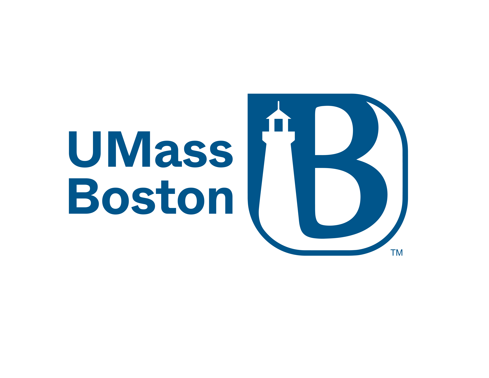

**About Us:**
The Kelliher Lab is investigating the circadian clock-- how most organisms tell time on planet Earth. Organisms use circadian clocks to align their behavior optimally with the 24-hour light/dark cycle.

To study the eukaryotic circadian clock, we use the model organism filamentous fungus <em>Neurospora crassa</em>. The core circadian clock components in <em>Neurospora</em> are functionally related to our human circadian clock. In the Kelliher lab, we use genetic, genomic, biochemical, and computational tools in clocks research.

Fungal, insect, and mammalian circadian clocks exist at the level of individual cells. Within each cell, daily time is kept through a transcription-translation feedback loop (TTFL). Shown above is the <em>Neurospora</em> TTFL, composed of the White Collar Complex (WCC) and FREQUENCY (FRQ).

The Kelliher lab is part of the Department of Biology at the University of Massachusetts Boston. We are located in the Integrated Sciences Complex (ISC), newly built in 2015!

**The Kelliher Lab**\\
100 Morrissey Blvd.\\
Boston, MA 02125\\
<a href="https://www.google.com/maps/place/Integrated+Sciences+Complex/@42.314013,-71.041035,15z/data=!4m5!3m4!1s0x0:0x1fd14e0182a90286!8m2!3d42.314013!4d-71.041035" target="_blank">Find us on Google Maps</a>

