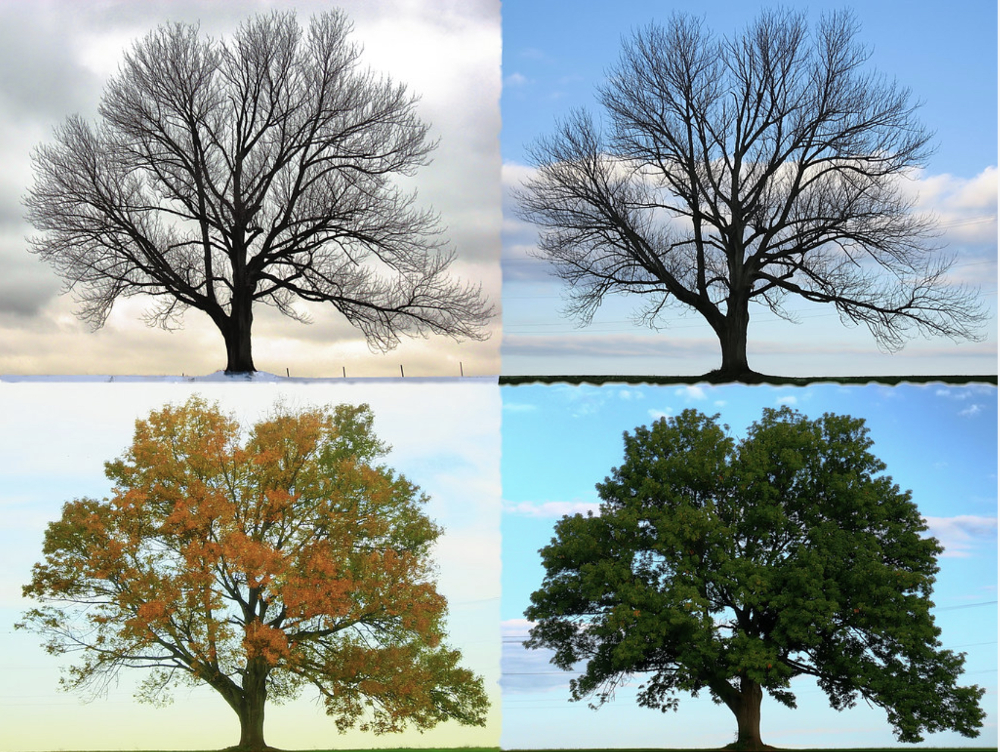
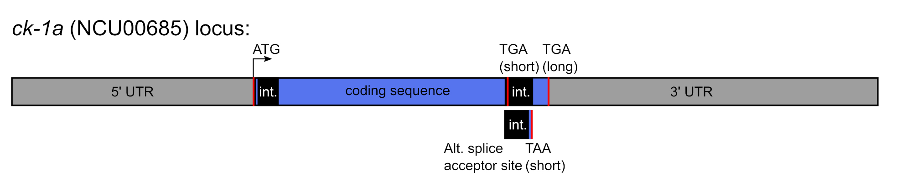

### Circadian clock compensation

Just like humans and other Earthlings, fungi experience large fluctuations in their environment on a daily and seasonal basis. For the circadian clock to be useful to an organism, it must keep accurate time across all physiological environmental conditions.

{:height="300px" width="399px"}
 
<a href="https://commons.wikimedia.org/wiki/File:%22Four_Seasons_-_Longbridge_Road%22.png" target="_blank">Four Seasons: Wikimedia Commons</a>

In the Kelliher lab, we have identified a group of <em>Neurospora crassa</em> mutant strains where compensation is no longer functional, and the ~24-hour circadian period length is no longer buffered against changes in temperature or nutrients in the environment. We seek to characterize the mechanisms of these compensation pathways and how they work to buffer the clock from the environment. We and others have found evidence that circadian compensation also functions in our cells! By defining pathways that shield the circadian clock from external nutrient levels, we aspire to find new ways to increase circadian and sleep/wake cycle robustness in patients suffering from metabolic diseases and diabetes, where external nutrient levels can be outside the healthy physiological range.

### Circadian-specific pool of a key kinase

Fungal, insect, and mammalian circadian clocks exist at the level of individual cells. Within each cell, daily time is kept through a transcription-translation feedback loop (TTFL). The <em>Neurospora crassa</em> TTFL is composed of the White Collar Complex (WCC) and FREQUENCY (FRQ). WCC acts as a transcription factor to turn on the <em>frq</em> gene once per day. FRQ protein is made after a time delay, and FRQ physically interacts with a kinase called Casein Kinase I (CKI). Unlike your typical kinase-substrate interaction, FRQ and CKI seem to bind together very stably throughout the negative arm phase of the TTFL. FRQ, CKI, and a third complex member FRH then feed back to inhibit WCC activity in the nucleus and to stop new <em>frq</em> synthesis.

The <em>casein kinase I</em> (<em>ck-1a</em>, <a href="https://fungidb.org/fungidb/app/record/gene/NCU00685" target="_blank">NCU00685</a>) gene in <em>Neurospora crassa</em> is extremely complex-- it's 3' Untranslated Region (UTR) is among the top 1% longest annotated among all genes in the genome! The CKI kinase is involved in many cellular pathways in addition to its key role in the circadian clock. In the Kelliher lab, we ask how the clock-relevant pool of CKI mRNAs and/or proteins is specified for FRQ binding and clock function. We have uncovered multiple functional domains in the 5' and 3' UTRs of <em>ck-1a</em> and seek to define the circadian functions of each of the 3 annotated protein isoforms of the CKI kinase.

{:height="185px" width="900px"}
 

### Circadian functional genomics
<em>Neurospora crassa</em> is unique among the model systems used to study the circadian clock. In a highly successful 10-year NIH NIGMS-funded multi-university project, a whole genome single-gene knockout collection was built for <em>Neurospora</em> (2004 – 2014; NIGMS P01 GM068087). 7,167 out of 10,082 genes (71.1%) are not essential for viability. It is the long term goal of the Kelliher lab to screen through functional groups of genes to identify new and unexpected regulators of the circadian clock. This process is well underway, with dozens of new mutants identified with long period, short period, or less robust / arrhythmic circadian clock phenotypes. Multiple genes identified with new circadian defects are of completely unknown biological function!

### Interested in learning more about our research projects?
PI Contact Information: Tina Kelliher\\
Email: christina.kelliher@umb.edu\\
Telephone: xxx-xxx-xxxx\\
Office Location: ISC xxxx
